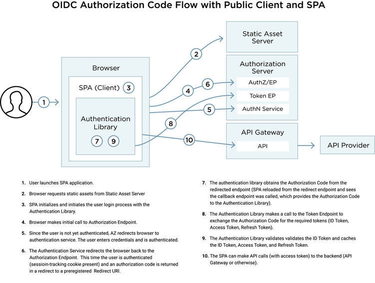

# ui

regenerate schema types

  $ yarn apollo:generate

the add _export default null_ to GlobalTypes

## data integrity

### user credentials

Any leak of user credentials affects data intergity.

Company domain user credentials give access to company IT resources.

### Oauth

[Oauth 2.0](https://oauth.net/2/) provides authorisation flows whereby credentials are only ever entered into identity providers (authorisation servers).

These identity providers handle authentication.

Many Single Page Applications (SPAs) use the [implicit](https://oauth.net/2/grant-types/implicit/) grant type.  However the [authorisation code](https://oauth.net/2/grant-types/authorization-code/) is more secure because the client secret cannot be given to a public client (such as a web browser).

#### Authorisation Code Grant

using authorisation code grant with a spa

https://auth0.com/blog/oauth2-implicit-grant-and-spa/

https://tools.ietf.org/html/draft-parecki-oauth-browser-based-apps-02

https://www.pingidentity.com/en/company/blog/posts/2018/securely-using-oidc-authorization-code-flow-public-client-single-page-apps.html

https://medium.com/@robert.broeckelmann/when-to-use-which-oauth2-grants-and-oidc-flows-ec6a5c00d864

1) APP links browser to API/login

2) API/login redirects to AS/login

3) AS login redirects to APP/callback with a code

4) APP posts code to API/callback

5) API Authorises on AS/Authorise with code and client secret

6) AS returns AccessCode and RefreshToken to API

7) API fetches user info with AccessCode

8) API returns JWT to APP signed with its APP_SECRET

    return res.send({
      jwt: jwt.sign({ user }, config.get('appSecret')),
    })

App opens web socket with JWT in connectionParams

API verifies and decodes JWT